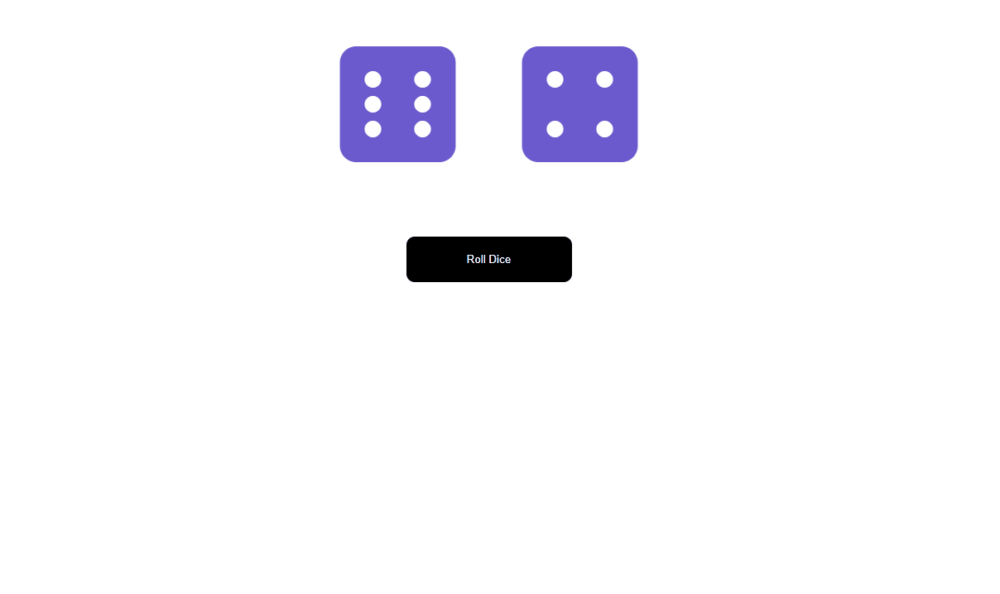

# React State Exercises

- React State Exercises
  - **Roll Dice**
  1. Component Structure
  2. Making Dice
  3. Rolling Dice
- Further Study
  - Animation
  - Changing Button Text

### This exercise practices working with props, defaultProps, state, and simple click events in React.

---

## Step 1: Component Structure

Make two components:

- RollDice - a parent component (rendered by App) that renders the dice and a button to roll.
- Die - an individual die that takes props and displays the correct face of the die based on props.

## Step 2: Making Dice

Font Awesome has handy dice classes for us: https://fontawesome.com/icons/dice-one?style=solid

Your Die.js component would just be an icon that dynamically changes its class to the proper die face based on props from the parent component’s state.

## Step 3: Rolling Dice

The RollDice component should have:

- the state for both of the dice
- a roll() method that rolls them to randomly get a new result

```
Your roll method can pick a random element from the array for each die, then update the state, causing the dice to re-render to the appropriate values.

Remember that these values will have to be translated into fas fa-dice-one through fas fa-dice-six for the child component to receive the appropriate class name through its props.
```

## Further Study

### Animation

---

- The solution displays an animation every time the dice are rolled.
- A new piece of state is necessary to say whether the dice are currently rolling or not.
- This is done by appending a class containing a CSS animation, and then removing it after one second (hint: setTimeout with setState, but be careful what this references!).

### Changing Button Text

- The button can also dynamically change its text and become disabled (un-clickable) until the animation has completed.

- It relies on the additional piece of state that says whether the dice are currently rolling or not.

## Sreenshots

---


